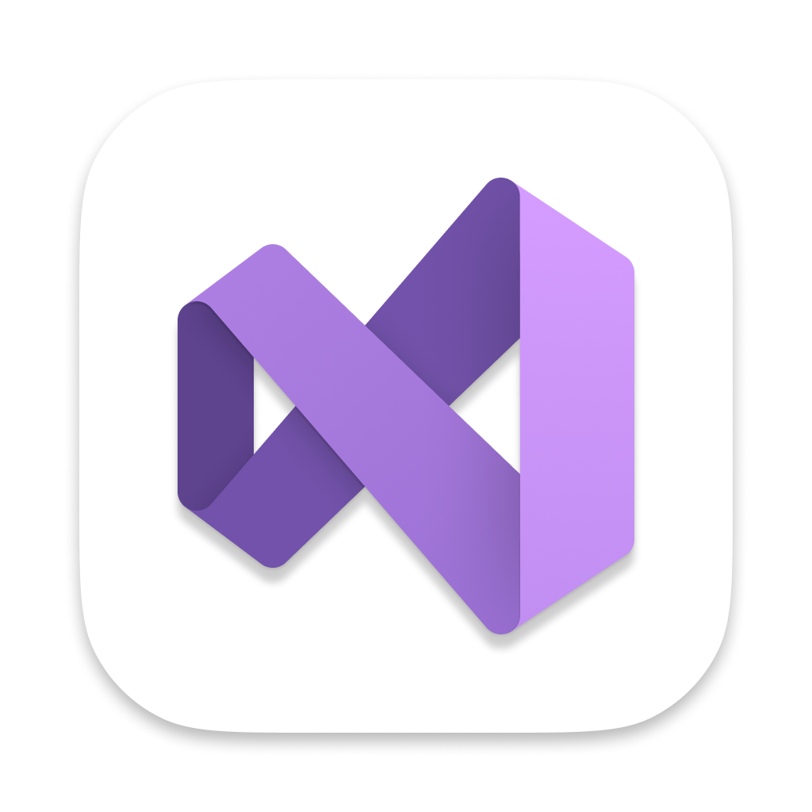

# EF-Core-NTV
 
<h2>Terminal commands and Results</h2>
  
 
      
Terminal Command <small><strong>(Click me)</strong></small>

       
  

  

      
Terminal Result <small><strong>(Click me)</strong></small>

       
  

<h1>Deployment</h1>
<ul>
    <h2>Using Github Pages</h2>
    <li>
        Navigate to the GitHub <a href="https://github.com/LittleCanOpener/EF-Core-NTV/tree/main" target="_blank">Repository</a>:
    </li>
    <li>
        Click the 'Settings' Tab.
    </li>
    <li>
        Scroll Down to the Git Hub Pages Heading.
    </li>
    <li>
        Select 'Master Branch' as the source.
    </li>
    <li>
        Click the Save button.
    </li>
    <li>
        Click on the link to go to the live deployed page.
    </li>
</ul>
<ul><h2>Run Locally</h2>
<li>
  Navigate to the GitHub <a href="https://github.com/LittleCanOpener/EF-Core-NTV/tree/main" target="_blank">Repository</a>:
</li>
<li>
  Click the Code drop down menu.
</li>
<li>
  Either Download the ZIP file, unpackage locally and open with IDE (This route ends here) OR Copy Git URL from the HTTPS dialogue box.
</li>
<li>
  Open your developement editor of choice and open a terminal window in a directory of your choice.
</li>
<li>
  Use the 'git clone' command in terminal followed by the copied git URL.
A clone of the project will be created locally on your machine.
</li>
</ul>
<h1>Technologies</h1>
<ol>
    <li>
        <h3>Microsoft Visual Studio & Visual Studio Code</h3>
        
Download Here <a href="https://visualstudio.microsoft.com/" target="_blank">Visual Studio</a>: 
        <h1>Why Microsoft Visual Studio Code?</h1>
       
    <ul>
        <li>
            <strong>Lightweight and Fast:</strong> 
            Microsoft Visual Studio Code is designed to be a lightweight editor, making it quick to install and run compared to full Integrated Development Environments (IDEs).
        </li>
        <li>
            <strong>Cross-Platform:</strong> 
            It is available on Windows, macOS, and Linux, allowing developers to work on their preferred operating system.
        </li>
        <li>
            <strong>Extensibility:</strong> 
            It has a rich ecosystem of extensions that provide support for various programming languages, frameworks, and tools, allowing developers to customize their environment.
        </li>
        <li>
            <strong>Integrated Terminal:</strong> 
            Microsoft Visual Studio Code comes with an integrated terminal, making it easy to run commands and scripts without leaving the editor.
        </li>
        <li>
            <strong>IntelliSense:</strong> 
            It offers intelligent code completion, syntax highlighting, and parameter info, which helps speed up coding and reduces errors.
        </li>
        <li>
            <strong>Version Control Integration:</strong> Built-in support for Git allows for seamless version control, code collaboration, and managing code repositories.
        </li>
        <li>
            <strong>Debugging Support:</strong> 
            Microsoft Visual Studio Code provides powerful debugging features, allowing developers to set breakpoints, watch variables, and navigate through code efficiently.
        </li>
        <li>
            <strong>User-Friendly Interface:</strong> 
            The interface is clean and customizable, which enhances the user experience and productivity.
        </li>
        <li>
            <strong>Active Community:</strong> 
            A large community contributes to its ongoing development, provides tutorials, and shares extensions, making it easier for new users to get started.
        </li>
    </ul>
        <h1>Why Visual Studio Code?</h1>
     
    <ul>
        <li>
            <strong>Lightweight and Fast:</strong> 
            VS Code is designed to be a lightweight editor, making it quick to install and run compared to full Integrated Development Environments (IDEs).
        </li>
        <li>
            <strong>Cross-Platform:</strong> 
            Available on Windows, macOS, and Linux, allowing developers to work on their preferred operating system.
        </li>
        <li>
            <strong>Extensibility:</strong>
            It has a rich ecosystem of extensions that provide support for various programming languages, frameworks, and tools, allowing developers to customize their environment.
         </li>
        <li>
            <strong>Integrated Terminal:</strong> 
            VS Code comes with an integrated terminal, making it easy to run commands and scripts without leaving the editor.
        </li>
        <li>
            <strong>IntelliSense:</strong> 
            It offers intelligent code completion, syntax highlighting, and parameter info, which helps speed up coding and reduces errors.
        </li>
        <li>
            <strong>Version Control Integration:</strong> Built-in support for Git allows for seamless version control, code collaboration, and managing code repositories.
        </li>
        <li>
            <strong>Debugging Support:</strong> 
            VS Code provides powerful debugging features, allowing developers to set breakpoints, watch variables, and navigate through code efficiently.
        </li>
        <li>
            <strong>User-Friendly Interface:</strong> 
            The interface is clean and customizable, which enhances the user experience and productivity.
        </li>
        <li>
            <strong>Active Community:</strong> 
            A large community contributes to its ongoing development, provides tutorials, and shares extensions, making it easier for new users to get started.
        </li>
    </ul>
        

    </li>
    <li>
        <h3>Git</h3>

         
        Why <a href="https://git-scm.com/" target="_blank">Git</a>: 
        Git is a DevOps tool used for source code management. It is a free and open-source version control system used to handle small to very large projects efficiently. Git is used to tracking changes in the source code, enabling multiple developers to work together on non-linear development.
        

    </li>
    <li>
        <h3>Github</h3>

         
        Why <a href="https://github.com/" target="_blank">Github</a>: 
        Well It's used for storing, tracking, and collaborating on software projects. It makes it easy for developers to share code files and collaborate with fellow developers on open-source projects. GitHub also serves as a social networking site where developers can openly network, collaborate, and pitch their work 
        

    </li>
    <li>
        <h3>C#</h3>

         
        Why <a href="https://learn.microsoft.com/en-us/dotnet/csharp/" target="_blank">C#</a>: 
        <ul>
            <li>
            <strong>Object-Oriented:</strong> 
                C# supports object-oriented programming (OOP) principles, making it easier to manage larger codebases and promoting code reusability.
            </li>
            <li>
            <strong>Strongly Typed:</strong> 
                C# is a strongly typed language, which helps catch errors at compile time, enhancing code reliability.
            </li>
            <li>
            <strong>Rich Library Support:</strong>
                C# has access to the extensive .NET libraries, providing a wide range of functionalities, from file handling to web services.
            </li>
            <li>
            <strong>Cross-Platform:</strong> 
                With .NET Core and .NET 5 (and later versions), C# allows developers to build applications that can run on multiple operating systems, including Windows, macOS, and Linux.
            </li>
            <li>
            <strong>Versatile:</strong> 
                C# can be used for various types of applications, including web applications (using ASP.NET), desktop applications (using Windows Forms or WPF), mobile apps (using Xamarin), and game development (using Unity).
            </li>
            <li>
            <strong>Modern Language Features:</strong>          
                C# incorporates many modern programming features, such as asynchronous programming, LINQ (Language Integrated Query), pattern matching, and more, making it suitable for modern software development.
            </li>
            <li>
            <strong>Strong Community Support:</strong> 
                C# has a large and active community, providing numerous resources, libraries, and frameworks for developers to utilize.
            </li>
        </ul>
        

        <li>
        <h3>.NET</h3>

         
        Why <a href="https://dotnet.microsoft.com/en-us/" target="_blank">.NET</a>: 
        <ul>
            <li>
            <strong>Cross-Platform Development:</strong> 
                With .NET Core and .NET 5 and later, developers can build applications that run on Windows, macOS, and Linux.
            </li>
            <li>
            <strong>Language Flexibility:</strong> 
                .NET supports multiple programming languages, including C#, F#, and Visual Basic, allowing developers to use the language they are most comfortable with.
            </li>
            <li>
            <strong>Robust Libraries and Frameworks:</strong>
                It offers a vast set of libraries and frameworks, such as ASP.NET for web applications, Entity Framework for data access, and Xamarin for mobile apps, streamlining development.
            </li>
            <li>
            <strong>Integrated Development Environment (IDE):</strong> 
                Visual Studio, the primary IDE for .NET development, provides comprehensive tools, debugging capabilities, and a user-friendly interface that enhances productivity.
            </li>
            <li>
            <strong>Strong Community and Support:</strong>
                Being widely used, .NET has a large community, extensive documentation, and numerous resources, making it easier to find solutions and support.
            </li>
            <li>
            <strong>Performance:</strong>          
                .NET is designed for high-performance applications, with the latest versions offering considerable improvements in speed and efficiency.
            </li>
            <li>
            <strong>Security:</strong>
                It includes built-in security features, which help in building secure applications with less effort.
            </li>
            <li>
            <strong>Enterprise-Level Solutions:</strong> 
                .NET is commonly used for enterprise applications due to its scalability, reliability, and support for complex systems.
            </li>
        </ul>
        

    </li>
</ol>
